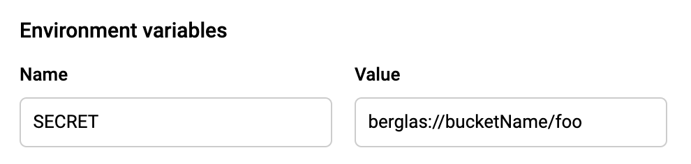

# secret-manager

- sample app that use berglas

# Setup

- https://github.com/GoogleCloudPlatform/berglas

## install berglas using brew

```
$> brew install berglas
```

## Enable required services

- If your project don't enable follow APIs, execute this command.

```
$> gcloud services enable --project ${PROJECT_ID} \
  cloudkms.googleapis.com \
  storage-api.googleapis.com \
  storage-component.googleapis.com
```

## init berglas

- berglas required gcs bucket.
- If not exist \$BUCKET_ID, berglas create the bucket.

```
$> berglas bootstrap --project $PROJECT_ID --bucket $BUCKET_ID
```

# Usage

## Create environment valuable

```
$> berglas create ${BUCKET_ID}/foo my-secret-data \
  --key projects/${PROJECT_ID}/locations/global/keyRings/berglas/cryptoKeys/berglas-key
```

## Grant access to a secret

```
$> berglas grant ${BUCKET_ID}/foo --member user:user@mydomain.com
$> berglas grant ${BUCKET_ID}/foo --member serviceAccount:[ProjectNumber]-compute@hoge.gserviceaccount.com
```

## Revoke access to a environment valuable

```
$> berglas revoke ${BUCKET_ID}/foo --member user:user@mydomain.com
$> berglas revoke ${BUCKET_ID}/foo --member serviceAccount:[ProjectNumber]-compute@hoge.gserviceaccount.com
```

## Delete environment valuable

```
$> berglas delete ${BUCKET_ID}/foo
```

# Examples

## setting environment to gcp resources

- set value e.g) berglas://\${BUCKET_ID}/key
  

## Library Usage

- Berglas is also a Go library that can be imported in Go projects:

```
import (
	_ "github.com/GoogleCloudPlatform/berglas/pkg/auto"
)
```

```
import (
	"context"
	"log"
	"os"

	"github.com/GoogleCloudPlatform/berglas/pkg/berglas"
)

func main() {
	ctx := context.Background()

	// This higher-level API parses the secret reference at the specified
	// environment variable, downloads and decrypts the secret, and replaces the
	// contents of the given environment variable with the secret result.
	if err := berglas.Replace(ctx, "MY_SECRET"); err != nil {
		log.Fatal(err)
	}

	// This lower-level API parses the secret reference, downloads and decrypts
	// the secret, and returns the result. This is useful if you need to mutate
	// the result.
	if v := os.Getenv("MY_SECRET"); v != "" {
		plaintext, err := berglas.Resolve(ctx, v)
		if err != nil {
			log.Fatal(err)
		}
		os.Unsetenv("MY_SECRET")
		os.Setenv("MY_OTHER_SECRET", string(plaintext))
	}
}
```

# How to migration KMS to SercretManager

- Please read this site
  https://cloud.google.com/blog/products/identity-security/introducing-google-clouds-secret-manager
